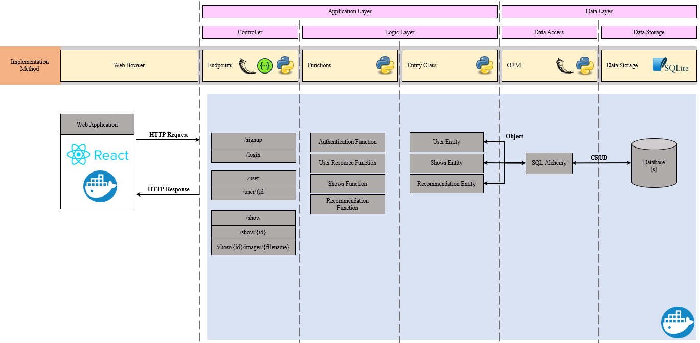
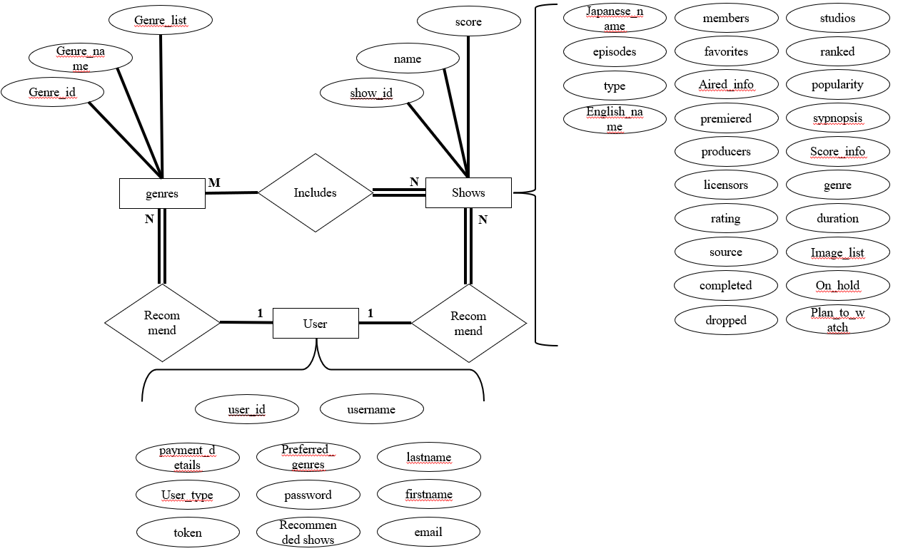
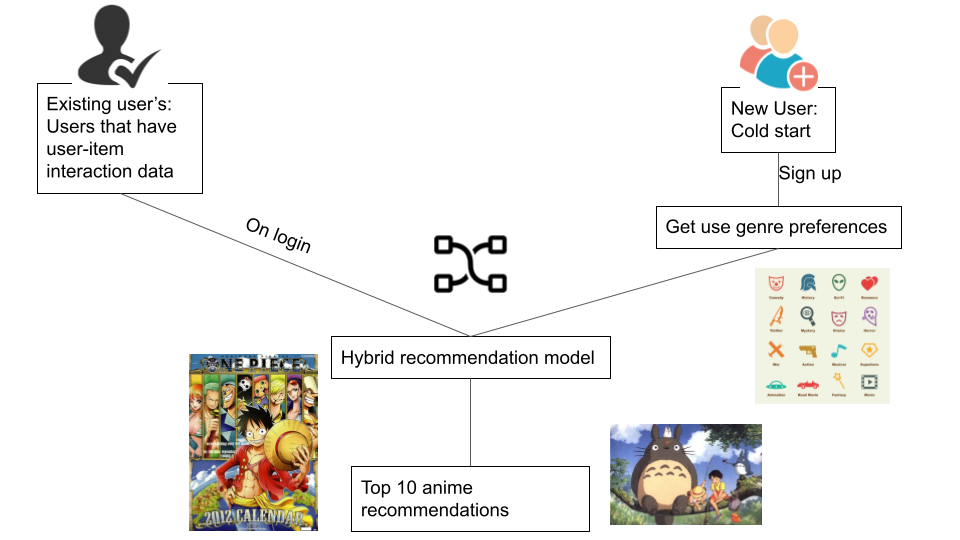

# COMP9900
This repository is built for 2021 T3 COMP9900 project - Movie Recommender System. The system revolves around the [Anime Recommendation Database 2020](https://www.kaggle.com/hernan4444/anime-recommendation-database-2020) found on Kaggle. 


## Functionalities and User Stories

## Collaborators
* Rahul Anil Damodaran
* Luyang Ye
* Akhil Kumar Yeruva
* Kamakshi Mathu
* Kan-Lin Lu

## System Architecture
Following presents the System Architecture.


## Database ER Diagram
Following presents the Entity Relation Diagram.


## Recommendation System Structure
Following presents the Recommendation system structure 


## Installation Guide
Please ensure to have Docker installed. Once installed, also install Docker-compose, as Front and Back are two seperate docker modules.

0. Install Docker compose
```
pip install docker-compose
```
1. Run
```
docker-compose up -d --force-recreate --build
```
**Once done, you should have database running on localhost:8080, and frontend running on localhost:3000.**

2. Shut down
```
docker-compose down
```
Check to see if there is any container still running if so, use the following to kill:
```
docker container kill <ID>
```
## Installation Guide (lubuntu20.04)

Referring to [lubuntu 20.04 Image](https://sourceforge.net/projects/linuxvmimages/files/VMware/L/lubuntu_20.04.1_VM.zip/download), please download a suitable vmware to execute.


1. Update System
```
sudo apt-get update
```
2. Install Docker Compose
```
sudo apt install docker-compose
```

The master branch contains run.sh with initialization process. The following within __init__.py of backend:
```
#!/bin/bash
python3 /COMP9900-backend/__init__.py ;
python3 /COMP9900-backend/db_server.py 
```
Then you should have the system running, note the initalization process can take up to 15 minutes, considering it directly pulls the latest dataset.

3a. Switch to Master Branch
```
git checkout master
git pull
```

Then you should be sitting at master branch of git.

### Execution

4. Now simply run using following command

```
sudo docker-compose up --force-recreate --build
```
Then you should have the system running, note the initalization process can take up to 15 minutes, considering it directly pulls the latest dataset.


## Remove
You can remove all volumes, images and network created, considering that the system builds itself once initialized.

1. Remove Everything
```
docker system prune -a 
```


